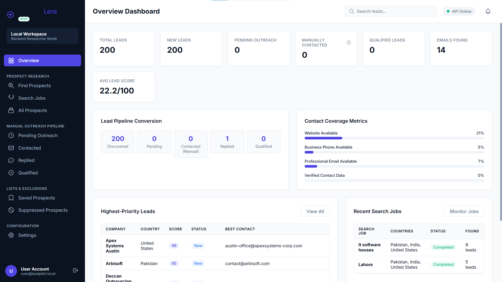
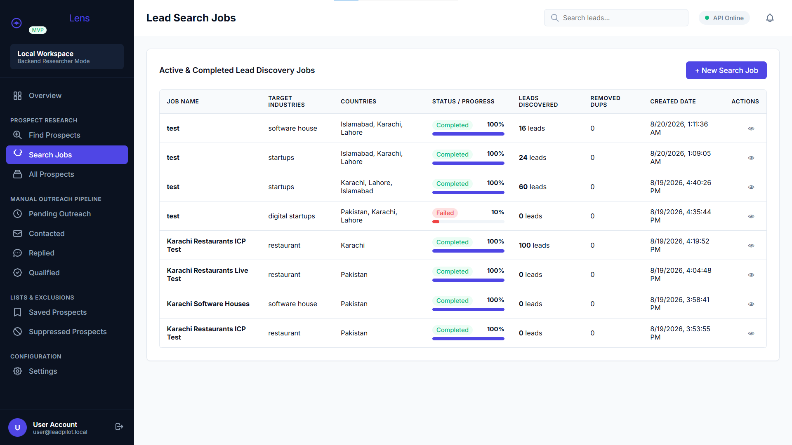

# ProspectLens

AI-powered B2B lead generation tool — discovers real business leads (via OpenStreetMap/Overpass and Tavily web search), scores and validates them, and drafts AI-personalized outreach using Groq. Built with a FastAPI backend and a vanilla JS/HTML/CSS frontend.

## Screenshots

**Dashboard Overview**


**All Leads / Prospects Table**


**Search Jobs**


## Features

- **Auth**: JWT-based authentication with Argon2id password hashing
- **Lead discovery**: Two swappable providers —
  - **Overpass/OpenStreetMap** (free, best for physical/walk-in businesses like restaurants, salons, clinics)
  - **Tavily web search** (free, best for B2B/office businesses like software houses and agencies)
- **Deterministic scoring & validation**: lead scoring, email/phone syntax checks — no AI guessing on facts
- **Background search jobs**: create a search, watch it progress (queued → discovering → validating → completed) without blocking
- **Leads CRUD**: notes, tags, status tracking, suppression list, full activity timeline
- **Dashboard**: aggregate stats, coverage metrics, CSV export
- **AI features (Groq)**: match explanations and outreach message drafts — prompts are explicitly constrained to never invent contact details or facts not present in the data
- **Rate limiting**: on auth endpoints to prevent abuse

## Tech Stack

- **Backend**: FastAPI, SQLAlchemy, PostgreSQL, Pydantic
- **Auth**: JWT (PyJWT) + Argon2id (pwdlib)
- **AI**: Groq API (`openai/gpt-oss-120b`)
- **Lead discovery**: Overpass API, Nominatim, Tavily API
- **Frontend**: Vanilla JavaScript, HTML, CSS (no build step)

## Getting Started

### Prerequisites

- Python 3.10+
- PostgreSQL (running locally)
- A [Groq API key](https://console.groq.com) (free)
- A [Tavily API key](https://tavily.com) (free, no card required)

### Backend Setup

```bash
# 1. Clone the repo
git clone https://github.com/dhanibaksh777-byte/ProspectLens.git
cd ProspectLens/backend

# 2. Create a virtual environment
python -m venv venv
venv\Scripts\activate      # Windows
# source venv/bin/activate   # macOS/Linux

# 3. Install dependencies
pip install -r requirements.txt

# 4. Set up environment variables
copy .env.example .env      # Windows
# cp .env.example .env       # macOS/Linux
```

Edit `.env` and fill in:

```
database_url=postgresql://postgres:<your_password>@localhost:5432/prospectlens
api_secret_key=<a long random string>
groq_api_key=<your Groq key>
tavily_api_key=<your Tavily key>
frontend_url=http://localhost:3000
```

Create the database:

```sql
CREATE DATABASE prospectlens;
```

Run the server:

```bash
uvicorn main:app --reload --port 5001
```

The API will be live at `http://localhost:5001`, with interactive docs at `http://localhost:5001/docs`.

### Frontend Setup

The frontend is a static vanilla JS app (no build step). Open the frontend folder and serve `index.html` with any local server, e.g. VS Code's **Live Server** extension. Make sure it's running on `http://localhost:3000` or `http://127.0.0.1:5500` (already whitelisted in the backend's CORS config).

> **Note:** Frontend source will be pushed to this repo shortly.

## Project Structure

```
backend/
├── main.py
├── requirements.txt
├── .env.example
└── app/
    ├── config.py
    ├── database.py
    ├── security.py
    ├── dependencies.py
    ├── rate_limit.py
    ├── models/
    ├── schemas/
    ├── routers/
    ├── services/
    │   ├── ai/
    │   └── providers/
    └── workers/
```

## License

Personal/portfolio project — not currently licensed for reuse.
